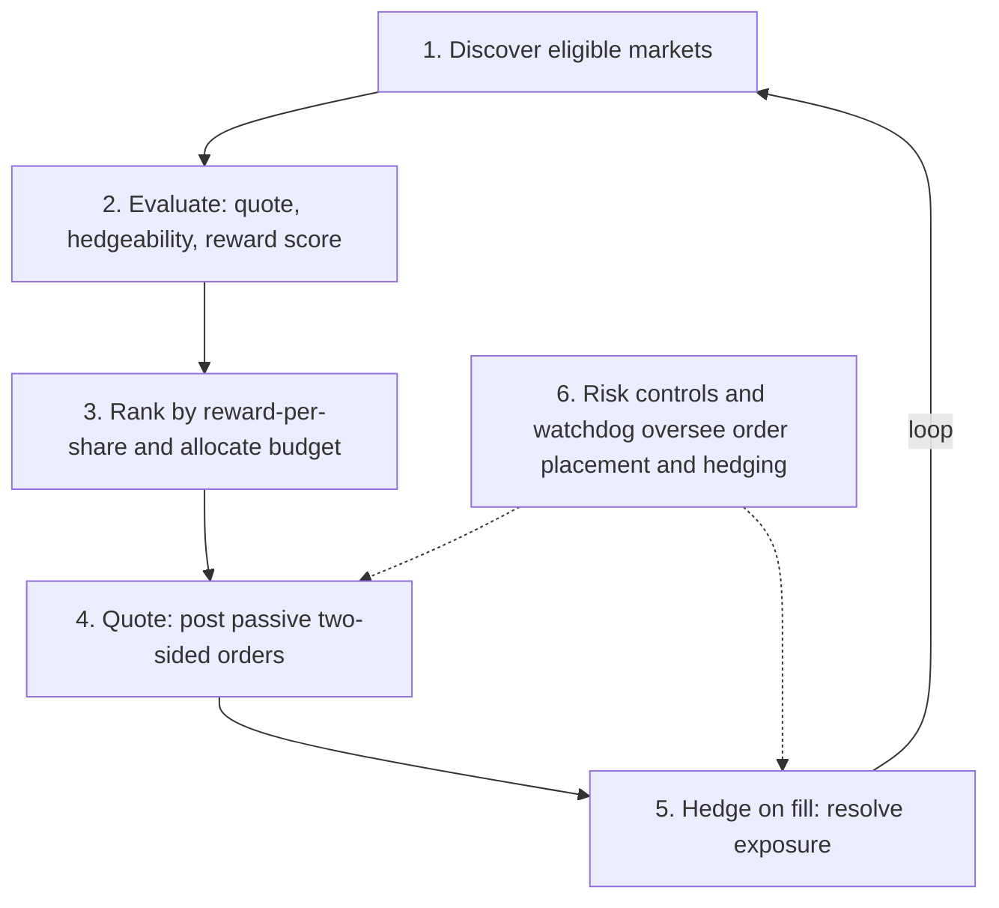
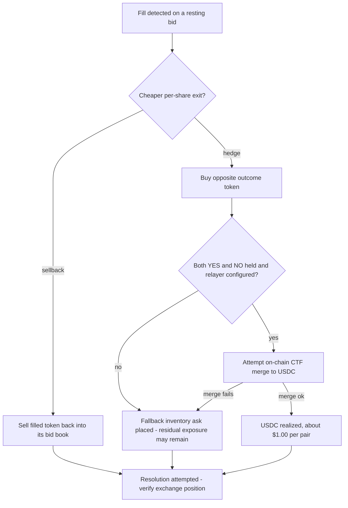

# SpreadEater

> A local-first Rust market-making bot for Polymarket that earns liquidity rewards while working to stay delta-neutral through post-fill hedging.

SpreadEater posts passive two-sided limit orders on binary prediction markets to earn Polymarket's liquidity rewards; when a fill is detected, it attempts to resolve the resulting exposure via an opposite-token hedge or sellback to minimize directional exposure. It is designed to be non-directional — profit comes from rewards, net of hedge costs and fees — though residual exposure can remain when a hedge misses or an on-chain merge fails (see [Safety](#safety)). The project also ships a companion monitor dashboard (web + terminal UI) for observing live runs.

**Profit = liquidity rewards − hedge costs − fees**

---

## Overview

Polymarket pays liquidity rewards to makers who post resting orders close to the mid-price on eligible markets. SpreadEater automates capturing those rewards while minimizing event-outcome risk:

- **Post passively** — resting limit orders on both sides (bids and reward asks) of eligible binary markets, priced to score well against Polymarket's reward function.
- **Hedge on fill** — when a fill is detected, SpreadEater attempts to resolve the resulting exposure through an opposite-token hedge or sellback, neutralizing the position as far as market conditions allow.
- **Merge to cash** — when both YES and NO tokens are held for the same market, *attempt* to merge the pair on-chain into USDC at $1.00 per pair via the Conditional Token Framework (CTF) contract or the Neg Risk Adapter. Merging requires a configured private key and relayer; if those are unavailable or a merge fails, the position is exited via inventory asks instead.

The bot never pre-hedges: capital is only put at risk after a confirmed fill. It runs entirely on the operator's own machine against Polymarket's public CLOB, Gamma, and data APIs.

| | |
| --- | --- |
| **Type** | Automated market-making bot + monitor dashboard |
| **Purpose** | Earn Polymarket maker rewards without directional exposure |
| **Strategy** | Two-sided passive quotes with immediate hedge-on-fill |
| **Language** | Rust (bot + monitor API/TUI); TypeScript + React (monitor web UI) |

> **Note:** This is an active, experimental trading system that places real orders and risks real funds when run in live mode. See [Safety](#safety) before running anything that touches real money.

---

## Why Polymarket pays makers

Polymarket runs a **liquidity rewards program**: for each eligible market it sets aside a daily reward pool and splits it among makers according to how much tight, useful liquidity each one posts. That subsidy — not a spread captured from takers — is the reason SpreadEater exists.

Each resting order is scored by a spread-utility function of how close it sits to the midpoint, relative to the market's max reward spread:

```text
S(v, s) = ((v - s) / v)^2 * b
```

- `v` — the market's **max spread** from the midpoint, in cents, within which orders earn rewards (`max_incentive_spread`)
- `s` — the order's spread (distance) from the size-cutoff-adjusted midpoint
- `b` — an in-game size multiplier

Orders closer to the mid (smaller `s`) score higher; orders beyond `v` score zero. Per-side book scores combine into a per-sample maker score `Q_min`, with a two-sidedness rule: for mid-range markets (midpoint roughly 0.10–0.90) single-sided liquidity still scores but at a reduced rate (divided by a scaling factor `c`, currently 3.0), while near the 0/1 tails liquidity must be two-sided to score at all.

A maker's reward is a **normalized, time-weighted share** of that pool — not a single instantaneous ratio. Polymarket:

1. samples each maker's score `Q_min` **every minute**,
2. normalizes it against all makers in that sample — `Q_normal = Q_min / Σ Q_min`,
3. sums those across the epoch — `Q_epoch = Σ Q_normal` over the **10,080** one-minute samples in an epoch (~7 days),
4. normalizes once more across all makers — `Q_final = Q_epoch / Σ Q_epoch`,

and the payout is:

```text
reward = Q_final * market reward pool
```

Rewards are distributed to maker addresses **daily at midnight UTC**, with a documented **$1 minimum payout** (smaller amounts are not paid). It is an allocation from a shared pool, not a guaranteed return — a maker's share scales with the pool and shrinks as competing liquidity grows.

> Formula and terminology per Polymarket's [Liquidity Rewards documentation](https://docs.polymarket.com/market-makers/liquidity-rewards) (as of July 2026). Venue reward mechanics can change; treat the official docs as the source of truth.

---

## How it works

A concise summary of the strategy. See [`STRATEGY.md`](STRATEGY.md) for the complete, authoritative breakdown.



1. **Discovery** — On a recurring interval, poll Polymarket's discovery/Gamma/data APIs for active binary markets and filter to reward-eligible candidates (minimum daily reward, sufficient time to expiry, actively accepting orders, distinct YES/NO token IDs).
2. **Evaluation** — For each candidate market, skip cheap tail outcomes, compute a 4-leg candidate quote set (YES bid, YES ask, NO bid, NO ask), verify the opposite book has enough depth to hedge within slippage limits, and estimate the expected reward share using Polymarket's scoring formula.
3. **Ranking & budget** — Sort viable markets by estimated reward per share and allocate available budget top-down. A bid-rotation "frontier" pass on the discovery cycle can displace at most one weaker market per cycle, and only when the improvement clears a configurable threshold (prevents churn on tiny deltas).
4. **Quoting** — Place passive bids priced a configurable fraction of the way from mid toward the reward floor, sized via score-share targeting and clamped by hedgeable depth and available budget. Resting orders are refreshed on an interval and cancel-replaced when they drift beyond a basis-point threshold.
5. **Hedge on fill** — A dedicated async fill-handler task (never blocked by discovery/refresh work) detects fills over the user WebSocket stream and neutralizes exposure. A greedy per-share cost comparison routes each share of exposure to whichever exit is cheaper: **hedge** (buy the opposite token, then CTF-merge the pair to USDC) or **sellback** (sell the filled token back into its bid book).
6. **Risk controls** — Per-market hedge timeout kill switch, opposite-book depth checks, slippage/hedge-cost caps, a cash reserve held back from the trading budget, and a two-layer watchdog (in-process Rust + external Python sidecar) that can halt and flatten on WebSocket/API failure.

### Fill resolution

When a fill is detected, the exposure is routed to whichever exit is cheaper per share, with explicit fallbacks if an on-chain merge is unavailable or fails:



---

## Architecture

SpreadEater is a Cargo workspace with three crates:

| Crate | Role |
| --- | --- |
| `spreadeater` (workspace root) | Main bot binary — CLI, discovery, strategy, trading/hedge engine, watchdog |
| `spreadeater-core` | Shared types consumed by both the bot and the monitor |
| `spreadeater-monitor` | Monitor dashboard binary — Axum HTTP/WebSocket API, terminal UI (ratatui), and the React web frontend |

### Bot module tree (`src/`)

| Module | Responsibility |
| --- | --- |
| `auth/` | API credentials, L2 HMAC-SHA256 request signing, EIP-712 order signing |
| `books/` | Order-book ingestion — REST bootstrap plus live WebSocket updates and caching |
| `config.rs` | Config loading and defaults |
| `discovery/` | Market discovery and reward-eligibility filtering |
| `models/` | Core domain types (market, order, quote, hedge, position) |
| `monitor/` | Event emission — the append-only JSONL producer and error logger |
| `persistence/` | Session and decision archives, startup retention pruning |
| `reporting/` | Shadow reports and CSV export |
| `runtime/` | Orchestrator, live engine, replay engine, run metadata |
| `strategy/` | Quote engine, hedgeability checks, viability gating, reward-score proxy |
| `trading/` | Trading client, order manager, hedge executor, risk controls, trade parsing |
| `watchdog/` | Watchdog manager, WebSocket health tracking, status-page poller, kill trigger |

### Monitor

The `spreadeater-monitor` crate provides an Axum API server (with WebSocket streaming), a projector that reads the bot's JSONL event stream into PostgreSQL, an optional terminal UI, and a React web dashboard (Overview, Open Orders, Inventory, History, Errors, Watchlist, Config tabs). The bot writes an append-only JSONL event log; the monitor consumes it — by design this keeps file and database work off the trading hot path (event emission is non-blocking through bounded channels).

---

## Prerequisites

- **Rust toolchain** (stable; 2021 edition). Install via [rustup](https://rustup.rs).
- **Polymarket account and API credentials** — an API key/secret/passphrase (L2 auth) plus, for live trading, a wallet private key, supplied via environment variables / a `.env` file. Never commit real credentials.
- **PostgreSQL** — required only for the monitor dashboard (a `docker-compose.monitor.yml` is provided to run it in Docker). The core bot does **not** use Postgres — it archives to files, and bot-side database persistence is reserved / not yet implemented. Postgres is consumed by the monitor only.
- **Python 3** — required only for the operator/watchdog helper scripts (e.g. the emergency kill-flatten script and the external watchdog sidecar), which use the Polymarket Python CLOB client for authenticated exchange actions (e.g. order cancellation / flatten). Not needed to build or run the core bot in shadow/dry-run mode.
- **Node.js** — required only if you want to build the React monitor web frontend from source.

---

## Market selection, ranking & liquidity guards

SpreadEater is deliberately conservative about *where* it quotes. Two ideas drive it: rank markets by reward efficiency, and never post liquidity it can't hedge. The exact thresholds live in [`STRATEGY.md`](STRATEGY.md) and [`CONFIG.md`](CONFIG.md); the design is below.

### Ranking

Each discovery cycle, candidate markets that pass the viability gate are sorted by **reward-per-share** — estimated reward divided by the shares the bot would have to commit — so capital flows to the markets that pay the most *per share of quoted size*, not simply the ones with the largest reward pools. Budget is then allocated top-down across that ranking.

To stop the book from thrashing, a conservative **frontier rotation** runs on the discovery cycle: it can displace at most one weaker market per cycle, only reclaims resting *bid* capital (never held inventory), and only fires when the incoming market's daily reward beats the outgoing one by a configurable margin — so the bot doesn't churn orders chasing sub-penny improvements that wouldn't cover costs.

### Liquidity guardrails — won't quote what it can't hedge

Because every fill has to be hedgeable, the bot refuses markets and orders it can't safely exit:

- **Eligibility filters** — only binary, actively-quoting markets with a real daily reward pool and enough time to expiry are even considered.
- **No cheap tails** — outcomes priced below a floor are skipped, avoiding the extreme-tail markets where a small adverse move is proportionally huge.
- **Hedgeability admission gate** — before a bid is placed, the bot walks the *opposite* book and clamps the order down to the size it can actually hedge there; if not even the minimum size is hedgeable, the bid is rejected outright.
- **Continuous depth checks** — while orders rest, opposite-book hedge depth is re-checked on a short interval: if it thins, the resting bid is scaled down proportionally; if hedge depth disappears, the bids are cancelled entirely (can't hedge → shouldn't be quoting).

In short: the bot admits bids only when current book depth provides a viable hedge path, then keeps monitoring that path; fills and market movement can still leave residual exposure.

---

## Usage

The bot is a single binary with subcommands. A global `--config <path>` flag (default `config.json`) applies to all of them. Build first, or use `cargo run -- <command>` during development.

| Command | Places real orders? | What it does |
| --- | --- | --- |
| `once` | No | Run a single shadow discovery + evaluation cycle and print a summary (markets evaluated, would-trade counts). No orders. |
| `run` | No | Run shadow mode continuously (discovery + evaluation loop, no orders). |
| `show-config` | No | Print the default configuration as JSON. |
| `auth-check` | No | Verify API credentials work (authenticated dry-run check). |
| `dry-run` | No | Run one full live-pipeline cycle with real auth but simulated orders. |
| `dry-run-loop` | No | Run the live pipeline continuously with real auth but simulated orders. |
| `live` | **Yes** (unless `--dry-run`) | **LIVE MODE** — real order placement, fill-triggered hedging, and kill switches. Requires `POLY_PRIVATE_KEY`. |
| `live --dry-run` | No | Run the live engine end-to-end with simulated orders (no real trades). |
| `export` | No | Export an archived session to CSV for spreadsheet analysis. `--session <path>` (default: latest in archive), `--output <path>`. |
| `replay` | No | Replay archived sessions through the current parameters for sensitivity analysis. `--path <file-or-dir>` (default `./data/archive`), `--competition-multiplier <f64>`. |

Examples:

```bash
# Verify credentials
cargo run -- auth-check

# Full-pipeline dry run (real auth, simulated orders) — recommended before going live
cargo run -- live --dry-run

# Live trading (real orders — see the Safety section)
cargo run -- live

# Export the latest archived session to CSV
cargo run -- export

# Replay archived sessions with an overridden competition multiplier
cargo run -- replay --path ./data/archive --competition-multiplier 2.0
```

### Monitor dashboard

The monitor is a separate binary/crate. It requires PostgreSQL (a `docker-compose.monitor.yml` is provided). Operator convenience scripts under `scripts/` (`start-monitor`, `open-monitor`, `restart-monitor`, `stop-monitor`, in `.cmd`/`.ps1`/`.sh` variants) bring up Postgres and the monitor server and print the local dashboard URL. The web dashboard exposes Overview, Open Orders, Inventory, History, Errors, Watchlist, and Config tabs.

---

## Safety

**Running `live` (without `--dry-run`) places real orders on Polymarket and puts real funds at risk.** It requires a wallet private key (`POLY_PRIVATE_KEY`) and will buy and sell outcome tokens, execute hedges, and — when a relayer is configured — attempt to merge positions on-chain automatically.

- **Always test in shadow / dry-run first.** Use `once`, `run`, `auth-check`, `dry-run`, `dry-run-loop`, and `live --dry-run` to validate configuration and behavior before committing real capital.
- **Guard your credentials.** Never commit `.env`, private keys, API secrets, or wallet addresses. Treat the private key as you would any wallet key.
- **Understand the risk controls.** The hedge-timeout kill switch, opposite-book depth checks, slippage/hedge-cost caps, cash reserve, and watchdog reduce but do not eliminate risk. Hedges can miss, books can move, and on-chain merges can fail — leaving residual exposure that the bot attempts to flatten.
- **Watchdog enforcement is off by default.** In the shipped config the watchdog runs in observe-only mode (`enforce_actions: false`); it will not automatically halt/flatten unless you enable enforcement. The external Python sidecar is a separate crash-safety net.
- **The live hedge probe is dangerous.** The Layer 3 hedge test (see below) places real orders and costs real money. Do not run it against an account that has a live `spreadeater live` session in progress.

You are responsible for your own funds, credentials, and compliance. This software is provided as-is, with no warranty.

---

## Development & testing

The hedge pipeline has a dedicated, layered test suite documented in full in [`HEDGE_TESTING_SUITE.md`](HEDGE_TESTING_SUITE.md). Use the cheapest, safest layer that answers your question — do not jump to Layer 3 unless you need live exchange behavior.

| Layer | Money risk | What it proves |
| --- | --- | --- |
| **Layer 1** — deterministic harness | None | Post-attribution hedge resolution: side selection, sizing, hedge-vs-sellback split, post-sync truth, halt behavior. Runs against a mock exchange. |
| **Layer 2** — event replay | None | Pre-attribution event path: raw-trade attribution, order-update fallback, exchange-sync missed-fill detection, orphan recovery, reconciliation routing. |
| **Layer 3** — live hedge probe | **Real** | The real downstream hedge path against live books, balances, and order submission. Places real orders — operator-only, use tiny share caps on a quiet market. |

These layers run through the standard Rust test harness (`cargo test`), not as production CLI subcommands. Typical commands:

```bash
# Fast compile / type check
cargo check --quiet

# Layer 1 (deterministic, no money risk)
cargo test --bin spreadeater layer1_ -- --nocapture

# Layer 2 (replay, no money risk)
cargo test --bin spreadeater layer2_ -- --nocapture

# Full workspace test suite
cargo test --workspace --all-targets
```

Fixtures live under `fixtures/` (e.g. `fixtures/hedge_scenarios/`, `fixtures/hedge_replay_scenarios/`, `fixtures/hedge_live_probe_scenarios/`). Operator/benchmarking helper scripts (offline run summarizers, benchmark comparison, the watchdog sidecar, and the emergency kill-flatten script) live under `scripts/`.

---

## Documentation index

| Document | Contents |
| --- | --- |
| [`STRATEGY.md`](STRATEGY.md) | Complete strategy breakdown — core thesis, market selection, quote pricing, hedge execution, CTF merge, and risk controls. |
| [`CONFIG.md`](CONFIG.md) | Reference for every field in the JSON config file. |
| [`HEDGE_TESTING_SUITE.md`](HEDGE_TESTING_SUITE.md) | The three-layer hedge test suite: what each layer proves, how to run it, and safety rules. |

---

## Status & caveats

- **Active / experimental.** SpreadEater is a working but evolving system, developed and operated against Polymarket's live CLOB. Behavior, config keys, and internal APIs change as the strategy is tuned.
- **Polymarket-specific.** It targets Polymarket's CLOB V2 (EIP-712 order signing, match-time fees) and reward program; it is not a general-purpose exchange bot.
- **No guarantees.** Rewards, hedge availability, and merge execution all depend on live market and venue conditions outside the bot's control. Past behavior is not indicative of future results.
