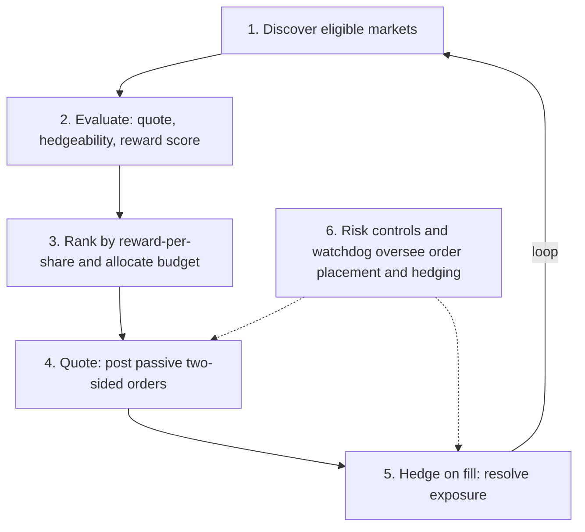
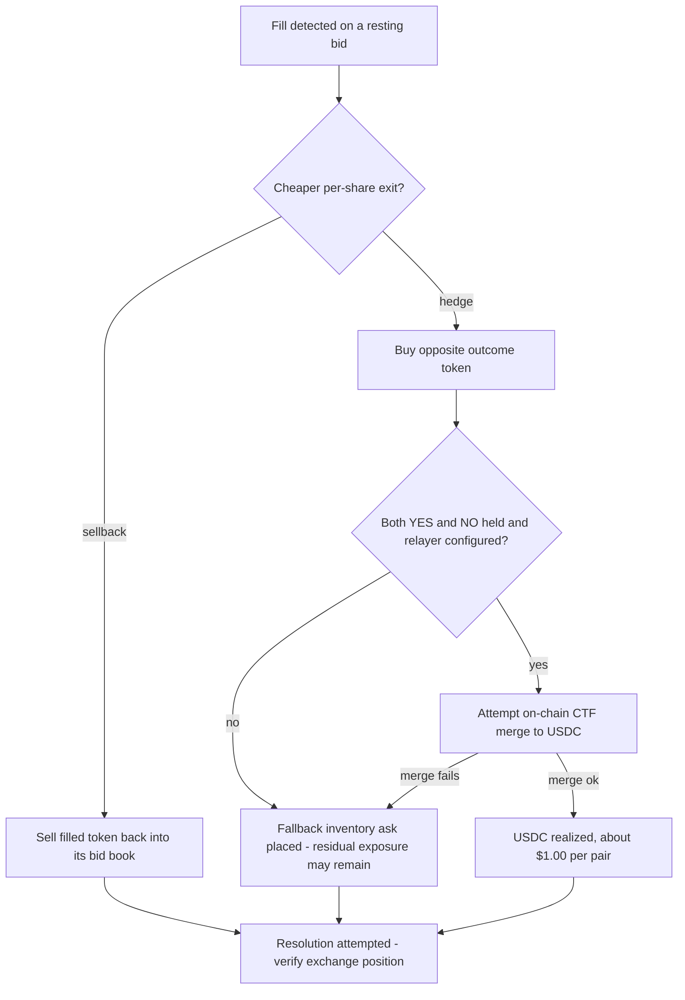

# SpreadEater

> A local-first Rust market-making bot for Polymarket that earns liquidity rewards while working to stay delta-neutral through post-fill hedging.

SpreadEater posts passive two-sided limit orders on binary prediction markets to earn Polymarket's liquidity rewards; when a fill is detected, it attempts to resolve the resulting exposure via an opposite-token hedge or sellback to minimize directional exposure. It is designed to be non-directional — profit comes from rewards, net of hedge costs and fees — though residual exposure can remain when a hedge misses or an on-chain merge fails.

**Profit = liquidity rewards − hedge costs − fees**

---

## Overview

Polymarket pays liquidity rewards to makers who post resting orders close to the mid-price on eligible markets. SpreadEater automates capturing those rewards while minimizing event-outcome risk:

- **Post passively** — resting limit orders on both sides (bids and reward asks) of eligible binary markets, priced to score well against Polymarket's reward function.
- **Hedge on fill** — when a fill is detected, SpreadEater attempts to resolve the resulting exposure through an opposite-token hedge or sellback, neutralizing the position as far as market conditions allow.
- **Merge to cash** — when both YES and NO tokens are held for the same market, *attempt* to merge the pair on-chain into USDC at $1.00 per pair via the Conditional Token Framework (CTF) contract or the Neg Risk Adapter. Merging requires a configured private key and relayer; if those are unavailable or a merge fails, the position is exited via inventory asks instead.

The bot never pre-hedges: capital is only put at risk after a confirmed fill. It runs entirely on the operator's own machine against Polymarket's public CLOB, Gamma, and data APIs.

| | |
| --- | --- |
| **Type** | Automated market-making bot + monitor dashboard |
| **Purpose** | Earn Polymarket maker rewards without directional exposure |
| **Strategy** | Two-sided passive quotes with immediate hedge-on-fill |
| **Language** | Rust (bot + monitor API/TUI); TypeScript + React (monitor web UI) |

> **Status — research project, not a live earner.** SpreadEater was built and analyzed as a study of Polymarket rewards market-making. It works as engineering, but it was never shown to have a positive net edge after real costs — see [Why it doesn't work](#why-it-doesnt-work).

---

## Why Polymarket pays makers

Polymarket runs a **liquidity rewards program**: for each eligible market it sets aside a daily reward pool and splits it among makers according to how much tight, useful liquidity each one posts. That subsidy — not a spread captured from takers — is the reason SpreadEater exists.

Each resting order is scored by a spread-utility function of how close it sits to the midpoint, relative to the market's max reward spread:

```text
S(v, s) = ((v - s) / v)^2 * b
```

- `v` — the market's **max spread** from the midpoint, in cents, within which orders earn rewards (`max_incentive_spread`)
- `s` — the order's spread (distance) from the size-cutoff-adjusted midpoint
- `b` — an in-game size multiplier

Orders closer to the mid (smaller `s`) score higher; orders beyond `v` score zero. Per-side book scores combine into a per-sample maker score `Q_min`, with a two-sidedness rule: for mid-range markets (midpoint roughly 0.10–0.90) single-sided liquidity still scores but at a reduced rate (divided by a scaling factor `c`, currently 3.0), while near the 0/1 tails liquidity must be two-sided to score at all.

A maker's reward is a **normalized, time-weighted share** of that pool — not a single instantaneous ratio. Polymarket:

1. samples each maker's score `Q_min` **every minute**,
2. normalizes it against all makers in that sample — `Q_normal = Q_min / Σ Q_min`,
3. sums those across the epoch — `Q_epoch = Σ Q_normal` over the **10,080** one-minute samples in an epoch (~7 days),
4. normalizes once more across all makers — `Q_final = Q_epoch / Σ Q_epoch`,

and the payout is:

```text
reward = Q_final * market reward pool
```

Rewards are distributed to maker addresses **daily at midnight UTC**, with a documented **$1 minimum payout** (smaller amounts are not paid). It is an allocation from a shared pool, not a guaranteed return — a maker's share scales with the pool and shrinks as competing liquidity grows.

> Formula and terminology per Polymarket's [Liquidity Rewards documentation](https://docs.polymarket.com/market-makers/liquidity-rewards) (as of July 2026). Venue reward mechanics can change; treat the official docs as the source of truth.

---

## How it works

A concise summary of the strategy. See [`STRATEGY.md`](STRATEGY.md) for the complete, authoritative breakdown.



1. **Discovery** — On a recurring interval, poll Polymarket's discovery/Gamma/data APIs for active binary markets and filter to reward-eligible candidates (minimum daily reward, sufficient time to expiry, actively accepting orders, distinct YES/NO token IDs).
2. **Evaluation** — For each candidate market, skip cheap tail outcomes, compute a 4-leg candidate quote set (YES bid, YES ask, NO bid, NO ask), verify the opposite book has enough depth to hedge within slippage limits, and estimate the expected reward share using Polymarket's scoring formula.
3. **Ranking & budget** — Sort viable markets by estimated reward per share and allocate available budget top-down. A bid-rotation "frontier" pass on the discovery cycle can displace at most one weaker market per cycle, and only when the improvement clears a configurable threshold (prevents churn on tiny deltas).
4. **Quoting** — Place passive bids priced a configurable fraction of the way from mid toward the reward floor, sized via score-share targeting and clamped by hedgeable depth and available budget. Resting orders are refreshed on an interval and cancel-replaced when they drift beyond a basis-point threshold.
5. **Hedge on fill** — A dedicated async fill-handler task (never blocked by discovery/refresh work) detects fills over the user WebSocket stream and neutralizes exposure. A greedy per-share cost comparison routes each share of exposure to whichever exit is cheaper: **hedge** (buy the opposite token, then CTF-merge the pair to USDC) or **sellback** (sell the filled token back into its bid book).
6. **Risk controls** — Per-market hedge timeout kill switch, opposite-book depth checks, slippage/hedge-cost caps, a cash reserve held back from the trading budget, and a two-layer watchdog (in-process Rust + external Python sidecar) that can halt and flatten on WebSocket/API failure.

### Fill resolution

When a fill is detected, the exposure is routed to whichever exit is cheaper per share, with explicit fallbacks if an on-chain merge is unavailable or fails:



---

## Architecture

SpreadEater is a Cargo workspace with three crates:

| Crate | Role |
| --- | --- |
| `spreadeater` (workspace root) | Main bot binary — CLI, discovery, strategy, trading/hedge engine, watchdog |
| `spreadeater-core` | Shared types consumed by both the bot and the monitor |
| `spreadeater-monitor` | Monitor dashboard binary — Axum HTTP/WebSocket API, terminal UI (ratatui), and the React web frontend |

### Bot module tree (`src/`)

| Module | Responsibility |
| --- | --- |
| `auth/` | API credentials, L2 HMAC-SHA256 request signing, EIP-712 order signing |
| `books/` | Order-book ingestion — REST bootstrap plus live WebSocket updates and caching |
| `config.rs` | Config loading and defaults |
| `discovery/` | Market discovery and reward-eligibility filtering |
| `models/` | Core domain types (market, order, quote, hedge, position) |
| `monitor/` | Event emission — the append-only JSONL producer and error logger |
| `persistence/` | Session and decision archives, startup retention pruning |
| `reporting/` | Shadow reports and CSV export |
| `runtime/` | Orchestrator, live engine, replay engine, run metadata |
| `strategy/` | Quote engine, hedgeability checks, viability gating, reward-score proxy |
| `trading/` | Trading client, order manager, hedge executor, risk controls, trade parsing |
| `watchdog/` | Watchdog manager, WebSocket health tracking, status-page poller, kill trigger |

---

## Market selection, ranking & liquidity guards

SpreadEater is deliberately conservative about *where* it quotes. Two ideas drive it: rank markets by reward efficiency, and never post liquidity it can't hedge. The exact thresholds live in [`STRATEGY.md`](STRATEGY.md) and [`CONFIG.md`](CONFIG.md); the design is below.

### Ranking

Each discovery cycle, candidate markets that pass the viability gate are sorted by **reward-per-share** — estimated reward divided by the shares the bot would have to commit — so capital flows to the markets that pay the most *per share of quoted size*, not simply the ones with the largest reward pools. Budget is then allocated top-down across that ranking.

To stop the book from thrashing, a conservative **frontier rotation** runs on the discovery cycle: it can displace at most one weaker market per cycle, only reclaims resting *bid* capital (never held inventory), and only fires when the incoming market's daily reward beats the outgoing one by a configurable margin — so the bot doesn't churn orders chasing sub-penny improvements that wouldn't cover costs.

### Liquidity guardrails — won't quote what it can't hedge

Because every fill has to be hedgeable, the bot refuses markets and orders it can't safely exit:

- **Eligibility filters** — only binary, actively-quoting markets with a real daily reward pool and enough time to expiry are even considered.
- **No cheap tails** — outcomes priced below a floor are skipped, avoiding the extreme-tail markets where a small adverse move is proportionally huge.
- **Hedgeability admission gate** — before a bid is placed, the bot walks the *opposite* book and clamps the order down to the size it can actually hedge there; if not even the minimum size is hedgeable, the bid is rejected outright.
- **Continuous depth checks** — while orders rest, opposite-book hedge depth is re-checked on a short interval: if it thins, the resting bid is scaled down proportionally; if hedge depth disappears, the bids are cancelled entirely (can't hedge → shouldn't be quoting).

In short: the bot admits bids only when current book depth provides a viable hedge path, then keeps monitoring that path; fills and market movement can still leave residual exposure.

---

## Why it doesn't work

SpreadEater implements the full market-neutral loop — quoting both sides, then attempting to resolve detected fills back toward flat. Two things undercut it. First, live incidents showed that fill detection, hedging, verification, and flattening can each fail. Second, even when the loop runs cleanly, it never demonstrated a **positive net edge after real costs** — and that second problem is structural, worth walking through carefully because it's essentially the whole story.

```text
Net edge  =  rewards  -  hedge costs  -  sellback losses  -  fees  -  operational losses
```

Rewards are the only positive term, and they are small. Everything to the right is a leak — and the adverse fill is what blows the middle two wide open.

### The adverse fill

A liquidity-rewards maker is paid to rest passive orders near the midpoint. But a resting order only fills when someone *takes* it — and the case that hurts is the **book sweep**: a large marketable order that sweeps through multiple price levels in a single shot.

When that sweep lands, three things happen at once, and all of them hurt the maker:

1. **You get filled.** The passive order you posted to earn a sliver of reward is now a live position.
2. **The sweep runs the book over.** A large order doesn't stop at your level — it clears the levels behind you and pushes the price *through* your entry. The midpoint you were quoting against is gone.
3. **You're now on the wrong side, and drifting further from your entry** for as long as you stay exposed. The very size that filled you is the size that moved the market against you.

That is the crux: **the fill and the adverse move are the same event.** You aren't filled and *then* unlucky — the same order that fills you is the one that pushed the price through your level.

### Hedging doesn't save the trade

The bot's entire safety model is to neutralize immediately: hedge the opposite token, sell the position back, or merge the pair to cash. But **when resolution succeeds, getting flat and getting flat cheaply are not the same thing.**

By the time it reacts, the market it must exit into has already moved. The sweep has repriced the complementary outcome and can leave the hedge either shallow or expensive; selling back means crossing a spread that just widened; a merge only helps if both legs are held and the on-chain path is available. Those exit paths can price in the adverse move and crystallize a **trading loss even when exposure is successfully reduced.**

That loss is the killer, because of the asymmetry with what the strategy earns:

> **Rewards accrue in a slow trickle; adverse-fill losses arrive in a lump.**

The maker collects tiny reward increments continuously, across many markets, just for staying posted. A single severe adverse fill can hand back a large multiple of what those markets were paying — one bad exit can outweigh a long run of small reward accruals. **Ending up flat does not make that trade profitable.**

### Why the rest of the design can't rescue it

Every other feature compounds the same problem:

- **The safe rails that limit the damage also limit the income.** Skipping cheap longshots, capping size to hedgeable depth, and halting on trouble all reduce adverse-fill exposure — and each one also walls the bot off from the richest reward zones and caps what it can earn. The safer it is, the less it makes.
- **The reward you're competing for gets diluted.** Your share of a market's reward pool depends on how much other liquidity shows up, and the modeled capture assumes a competitive response you can't actually observe until you're in the market paying the spread.
- **The main path explored for earning materially more makes the core problem worse.** Scaling by holding more aggregate exposure than can be hedged at any instant could raise income — but it also turns a *correlated* burst of adverse fills (a news shock, when many markets move together and depth thins everywhere at once) from a rare event into the dominant failure mode.

### The conclusion

A delta-neutral rewards bot is buildable, and this one was built and run. But *hedged* is not the same as *profitable.* The income accumulated gradually, while adverse-fill losses could arrive in lumps; safety constraints also limited available reward capture. The reward was never shown to clear the cost of getting run over: the record does not demonstrate positive lifetime net P&L, and the strategy's own retrospective treats further scaling as unproven.

---

## Documentation index

| Document | Contents |
| --- | --- |
| [`STRATEGY.md`](STRATEGY.md) | Complete strategy breakdown — core thesis, market selection, quote pricing, hedge execution, CTF merge, and risk controls. |
| [`CONFIG.md`](CONFIG.md) | Reference for every field in the JSON config file. |

---

## Status & caveats

- **Research project, not a live earner.** SpreadEater was built and analyzed as a study of market-neutral rewards farming on Polymarket. It was not shown to clear its own costs (see [Why it doesn't work](#why-it-doesnt-work)) and is not run as a production earner.
- **Polymarket-specific.** It targets Polymarket's CLOB V2 (EIP-712 order signing, match-time fees) and reward program; it is not a general-purpose exchange bot.
- **No guarantees, not financial advice.** Reward, hedge, and merge behavior all depend on live venue conditions, and the strategy's own analysis concluded the edge was never demonstrated. Nothing here is a recommendation to trade.

---

## Acknowledgments

SpreadEater was built in collaboration with **[@gabrielsalazar777](https://github.com/gabrielsalazar777)**, who contributed to the strategy design and implementation.
